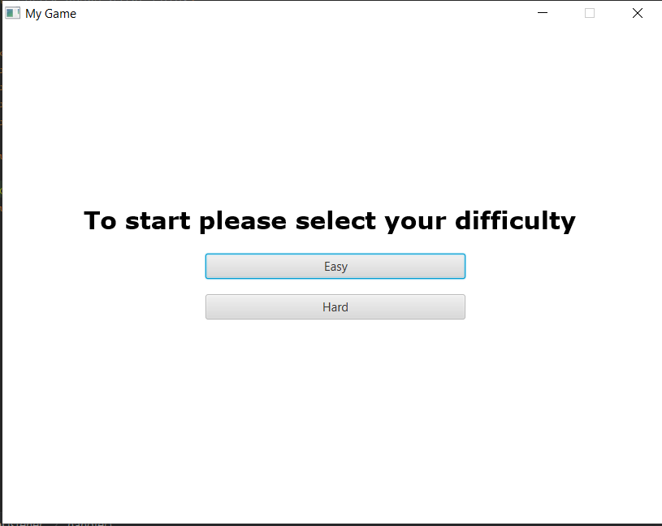
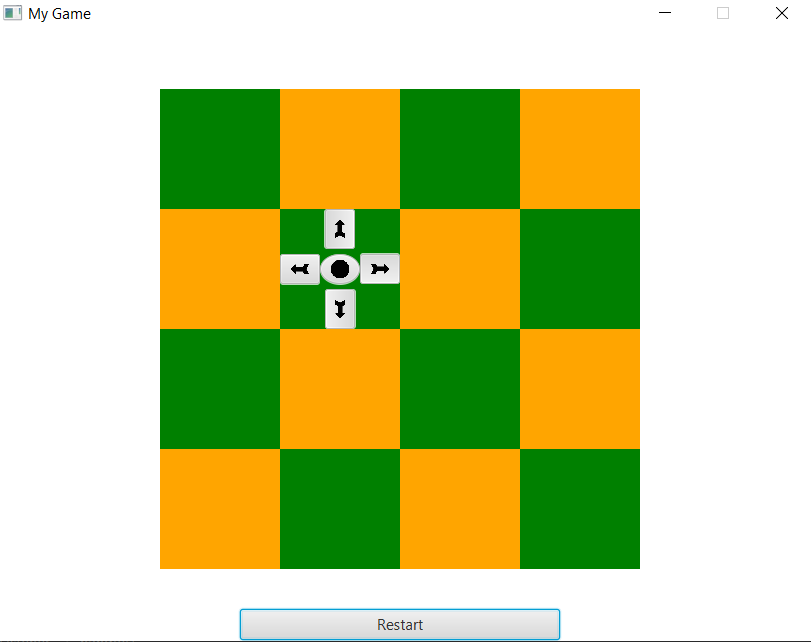
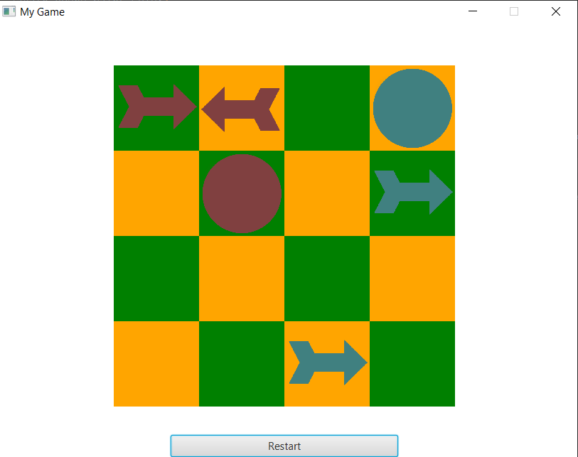
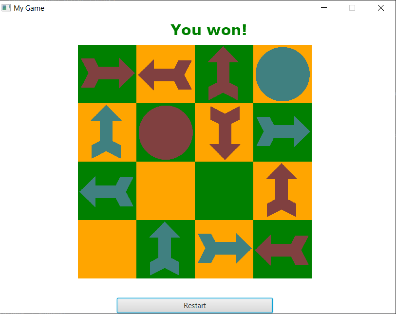
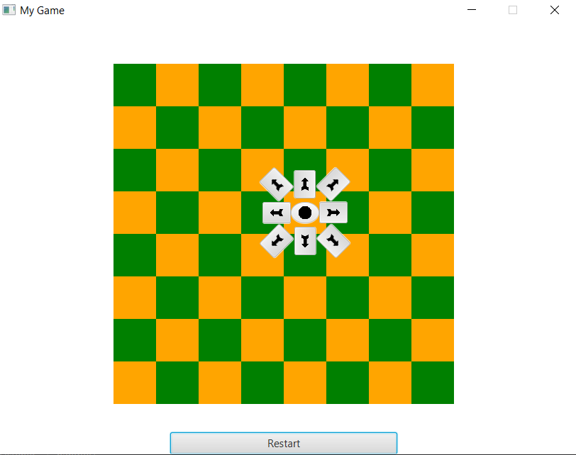

# Minimax-Game-Algorithm

A desktop application which represents a simple strategy game. The player has the possibility to play versus an "AI opponent" (on 2 different difficulties), who makes his moves based on the minimax algorithm.

This application was implemented using the following design patterns: Factory Method, Builder and Model-View-Controller (MVC).

Here are some screenshots:

The rule of the game is that a symbol can be found just once on a row, column or diagonal.
